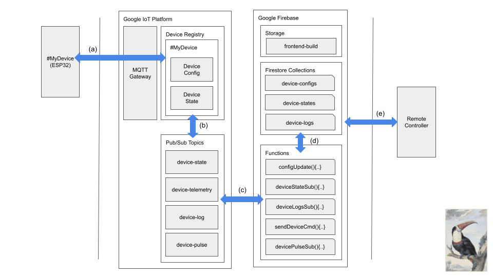

# IoT Esp32 GCP Guide - Part 1

This is a solution addresing the common patterns I came across while building remotely controllable embedded apllications. My goal is to show you a rapid way of building web interfacing emdedded products using ESP32 microcontroller and Google Cloud Platform. If you are already familier with the stack it is going to be relatively easy for you.

## Application stack 
* React | React Native (Part 2)
* Google Firebase (Part 2)
* Google Cloud Platform Core IoT 
* ESP-IDF

## Tools/Frameworks
* [PlatformIO](https://platformio.org)
  

## Bird view 



* **\#my-device(ESP32):** Your appliance | device | firmware | application how ever you wanna name it
* **Google IoT Platform**
  * **MQTT Gateway:** A lightweight communication protocal, pretty much standard for IoT connectivity
  * **Device Registery:** Googles way of organizing/grouping devices 
    *  **\#my-device:** This is where you device instance and data resides in cloud
  * **Pub/Sub Topics:** An asyncronious comminication protocol which will connect your device to web
 * **Google Firebase:** A platform for serverless mobile and web application development, reduces the amount of things that needs to be managed
   * **Storage:** Your static web application will be hosted from here
   * **Firestore Collections:** You application database
   * **Functions:** These functions connect our applications database and frontend to our device
 * **Remote Controller:** Anything that is connected to web with a competible browser on top to control our device, 

## Initial Configuration

First let's configure the IoT platform and then connect our device. You will need to create a google cloud platform project enable Google Cloud IoT API and link it to an active billing account. I find it much easier to use googles web console for some of the configuration work, so I will be using that and the [CLI](https://cloud.google.com/sdk) interchangeably. Assuming you created (preferably using the web console) a project named "my-iot-project-toucan" and billing is enabled let's continue on neccesary plumbing of services we are going to use. 

First we will create the Pub/Sub topics

```console
gcloud pubsub topics create device-log
gcloud pubsub topics create device-pulse
gcloud pubsub topics create device-telemetry 
```

Then we need a [registery](https://cloud.google.com/iot/docs/concepts/devices#device_registration) which is going to host your device properties like authentication, logging etc.. 

```console
gcloud iot registries create my-registry \
    --project=my-iot-project-toucan \
    --region=us-central1 \
    --state-pubsub-topic=projects/my-iot-project-toucan/topics/device-state \
    --event-notification-config=topic=projects/my-iot-project-toucan/topics/device-log,subfolder=logs \
    --event-notification-config=topic=projects/my-iot-project-toucan/topics/device-pulse,subfolder=pulse \
    --event-notification-config=topic=projects/my-iot-project-toucan/topics/device-telemetry 
```

Creates a registry in *projects/my-iot-project/locations/us-central1* called *my-registry*. Any telemetry events published will be forwarded to the default Cloud Pub/Sub topic *projects/my-iot-project-toucan/topics/device-telemetry*,  state messages will be forwarded to the Cloud Pub/Sub topic *projects/my-iot-project-toucan/topics/device-state*. And we have create two additional telemetry subfolders *logs* and *pulse* for organising the logs and keep alive messages of our device. 

Now we will create a device configuration which requires us to pass in the authetication method. I will be using RSA256 and you can create a key pair refering to this [guide](https://cloud.google.com/iot/docs/how-tos/credentials/keys#generating_an_rsa_key_with_a_self-signed_x509_certificate). 

```console
gcloud iot devices create my-device \
    --project=my-iot-project-toucan \
    --region=us-central1 \
    --registry=my-registry \
    --public-key path=./rsa_public.pem,type=rsa-pem
```

Creates a device my-device that will use RS256 authentication in registry *my-registry*. The public key certificate should be located in */rsa_cert.pem*. The certificate is used for only its public key, and its expiration value is ignored.


## The fun part, connecting the device 

I will be using PlatformIO for the device development part and I highly recommended ot for getting started with ESP-IDF development. Although I am one those who like to use minimum amount of layers necessary to build a product I failed to setup the ESP-IDF development tools chain after spending hours on it. In retrospect I am happy to move on with the PlatformIO, it solves the toolchain setup, updates are almost seemless (minor updates) and gives easy access to Arduino libraries that you could use in conjunction with the ESP-IDF framework. 

Now use the code provided in the repo under *DeviceCode* folder or create your project and make sure the framework is set to *Espressif IoT Development Framework*. And add [petit-gcp](https://platformio.org/lib/show/11561/petit-gcp ) library to your project. Add google certificate (for your convenience I added a copy in the repo) and the RSA private key to your project. And use this sample code to connect to google cloud. 

```c
#include "stdio.h"
#include "string.h"
#include "gcp_app.h"
#include "gcp_jwt.h"
#include "esp_log.h"
#include "nvs_flash.h"
#include "wifi_helper.h"

#define WIFI_SSID "xxx"
#define WIFI_PASSPHARSE "xxxx"
#define DEVICE_ID "my-device"
#define REGISTERY "my-registry"
#define REGION "us-central1"
#define PROJECT_ID "my-iot-project-toucan"


#define TAG "PETIT_APP"

extern const uint8_t gcp_jwt_private_pem_key_start[] asm("_binary_rsa_private_pem_start");
extern const uint8_t gcp_jwt_private_pem_key_end[] asm("_binary_rsa_private_pem_end");

extern const uint8_t iot_google_pem_key_start[] asm("_binary_google_roots_pem_start");
extern const uint8_t iot_google_pem_key_end[] asm("_binary_google_roots_pem_end");

/* set your JWT token to buffer*/
static void jwt_callback(const char *project_id, char *jtw_token_buffer)
{
    ESP_LOGI(TAG, "[jwt_callback]");
    char *token = create_GCP_JWT(project_id, (const char *)gcp_jwt_private_pem_key_start, gcp_jwt_private_pem_key_end - gcp_jwt_private_pem_key_start);
    strncpy(jtw_token_buffer, token, JWT_TOKEN_BUFFER_SIZE); //BUFFER SIZE
    free(token);
}

static void app_connected_callback(gcp_app_handle_t client, void *user_context)
{
    ESP_LOGI(TAG, "[app_connected_callback]");
    gcp_app_log(client, "tesdt");
    gcp_app_send_telemetry(client, "topic_love", "1");
}

static void app_disconnected_callback(gcp_app_handle_t client, void *user_context)
{
    ESP_LOGI(TAG, "[app_disconnected_callback]");
}

static void app_config_callback(gcp_app_handle_t client, gcp_app_config_handle_t config, void *user_context)
{
    char *pretty_config = cJSON_Print(config);
    ESP_LOGI(TAG, "[app_config_callback] app_config:%s \n", pretty_config);
    free(pretty_config);
}

static void app_command_callback(gcp_app_handle_t client, char *topic, char *command, void *user_context)
{
    ESP_LOGI(TAG, "[app_command_callback] topic:%s, cmd:%s", topic, command);
}

static void app_get_state_callback(gcp_app_handle_t client, gcp_app_state_handle_t state, void *user_context)
{
    ESP_LOGI(TAG, "[app_get_state_callback]");
    cJSON_AddStringToObject(state, "desire", "objet petit");
}

void app_main()
{
    // Initialize NVS.
    esp_err_t err = nvs_flash_init();
    if (err == ESP_ERR_NVS_NO_FREE_PAGES || err == ESP_ERR_NVS_NEW_VERSION_FOUND)
    {
        // 1.OTA app partition table has a smaller NVS partition size than the non-OTA
        // partition table. This size mismatch may cause NVS initialization to fail.
        // 2.NVS partition contains data in new format and cannot be recognized by this version of code.
        // If this happens, we erase NVS partition and initialize NVS again.
        ESP_ERROR_CHECK(nvs_flash_erase());
        err = nvs_flash_init();
    }
    ESP_ERROR_CHECK(err);

    wifi_credentials_t wifi_credentials = {
        .ssid = WIFI_SSID,
        .passphrase = WIFI_PASSPHARSE};
    wifi_helper_start(&wifi_credentials);
    wifi_helper_set_global_ca_store(iot_google_pem_key_start, iot_google_pem_key_end - iot_google_pem_key_start);
    wifi_wait_connection();

    gcp_device_identifiers_t default_gcp_device_identifiers = {
        .registery = REGISTERY,
        .region = REGION,
        .project_id = PROJECT_ID,
        .device_id = DEVICE_ID};

    gcp_app_config_t gcp_app_config = {
        .cmd_callback = &app_command_callback,
        .config_callback = &app_config_callback,
        .state_callback = &app_get_state_callback,
        .connected_callback = &app_connected_callback,
        .disconnected_callback = &app_disconnected_callback,
        .device_identifiers = &default_gcp_device_identifiers,
        .jwt_callback = &jwt_callback,
        .user_context = "What does it matter how many lovers you have if none of them gives you the universe?",
        .ota_server_cert_pem = (const char *)iot_google_pem_key_start};

    gcp_app_handle_t petit_app = gcp_app_init(&gcp_app_config);
    gcp_app_start(petit_app);
}
```


Events published to the without a subfolder, or with a subfolder that doesn't have a matching Pub/Sub topic will be forwarded to the Cloud Pub/Sub topic projects/my-iot-project/topics/device-telemetry. Messages published to logs and pulse subfolder will be forwarded to their corresponding Pub/Sub topics projects/my-iot-project-toucan/topics/device-log and projects/my-iot-project-toucan/topics/device-pulse. And finally state messages will be forwarded to topic projects/my-iot-project/topics/device-state.

